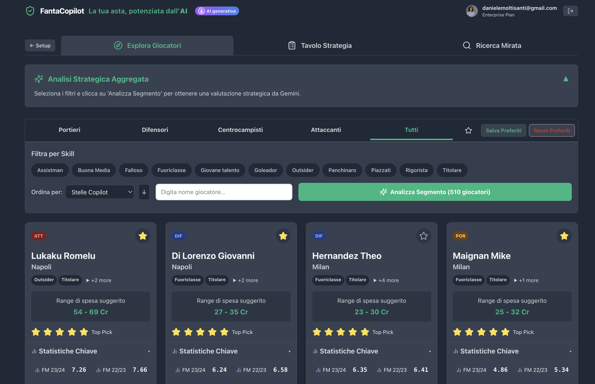

# Fantacalcio Auction Web App

**Live Auction**

<video src="demo/Registrazione schermo 2025-07-10 alle 10.45.12.mov" controls width="600"></video>

**Auction Preparation**

**GenAI Analysis on target players**

**Setup your strategy**

## Why This App? What Can You Do Now That Was Impossible Before?

This webapp revolutionizes the fantacalcio auction experience by dividing it into two main features:

### 1. Preparation for the Auction
- **Explore and Analyze:** Browse the entire player pool, filter by role, skills, or team, and search by name.
- **Favourites & Strategy:** Mark your favourite players, set personal targets, and use AI-powered analysis to plan your draft strategy.
- **Custom League Setup:** Configure participants, budgets, and role quotas to match your league’s rules.

### 2. Live Auction Support
- **Real-Time Auction Board:** Track every player’s status (available/taken), bids, and auction progress live.
- **Bidding Assistant:** Quickly select players, set bids, and assign winners with an intuitive interface.
- **Instant Team Updates:** See your team and all others update live after every auction action, even after a page refresh or device change.
- **Auction Log & Recovery:** All auction events are saved and can be restored anytime, from any device.

---

With this app, you can:
- Run your entire fantacalcio auction online, with all participants collaborating in real time.
- Instantly track every bid, player, and team—no manual updates, no lost information.
- Prepare your draft strategy with advanced filters, AI-powered analysis, and a personal favourites list.
- Restore your auction session anytime, from any device, with all data always in sync.
- Customize your league’s rules, budgets, and participants with a few clicks.
- Enjoy a beautiful, intuitive interface that works on desktop, tablet, and mobile.

This was never possible with traditional offline auctions, chat groups, or basic spreadsheets. Now, your fantacalcio auction is seamless, interactive, and stress-free.

## Features

### Real-Time Auction Management
- **Live Auction Board:** Track all players, their status (available/taken), and auction progress in real time.
- **Bidding Assistant:** Quickly select players, set bids, and assign winners with an intuitive interface.
- **Instant Feedback:** See your team and all participants' rosters update instantly after every auction action.
- **Auction Log:** All auction events are saved and can be restored after a page refresh or device change.
- **Reset Auction:** Start a new auction at any time with a single click.

### Team & Participant Management
- **Rosa Attuale (My Team):** Always see your up-to-date team, including purchase prices and roles.
- **Rose Partecipanti:** View all teams in the league, with real-time updates as players are bought.
- **Role & Budget Tracking:** Visualize remaining budget and role slots for every team.

### Player Exploration & Strategy
- **Preparation View:** Explore all players, filter by role, skills, or favourites, and search by name or team.
- **Favourites (Preferiti):** Mark and manage your target players for quick access during the auction.
- **Aggregated Analysis:** Get AI-powered strategic insights on filtered player segments (via Gemini integration).
- **Player Details:** See stats, skills, and recommendations for every player.

### League Customization
- **Flexible League Settings:** Configure participants, budgets, and role quotas to match your league's rules.
- **Persistent Settings:** All league settings are saved and reloaded automatically.

### Robust Data & Sync
- **Cloud or Local Storage:** Choose between SQLite (local) or Firestore (cloud) for data persistence.
- **Automatic Sync:** All auction and team data is kept in sync across devices and after refreshes.
- **Error Handling:** Smart fallbacks and debug messages ensure reliability even with network issues.

### Modern UI/UX
- **Responsive Design:** Works beautifully on desktop, tablet, and mobile.
- **Dark Mode:** Eye-friendly color scheme for long auction sessions.
- **Intuitive Navigation:** Fast, clear, and easy to use for all participants.

## What Can You Do With This App?
- Run your entire fantacalcio auction online, with all participants collaborating in real time.
- Track every bid, player, and team with zero manual paperwork.
- Prepare your draft strategy with advanced filters, AI analysis, and favourites.
- Never lose your auction data—restore your session anytime, from any device.
- Customize the league to your exact rules and preferences.

## Getting Started
1. **Clone the repository** and install dependencies for both backend and frontend.
2. **Configure your league** (participants, budget, roles) in the web UI.
3. **Start the auction** and enjoy a seamless, interactive experience!

---

<strong>🇮🇹 Versione Italiana</strong>

Questa webapp rivoluziona l'esperienza dell'asta fantacalcio, suddividendola in due grandi funzionalità:

### 1. Preparazione all'Asta
- **Esplora e Analizza:** Sfoglia l'intera lista giocatori, filtra per ruolo, skill o squadra e cerca per nome.
- **Preferiti & Strategia:** Segna i tuoi giocatori preferiti, imposta obiettivi personali e sfrutta l'analisi AI per pianificare la tua strategia d'asta.
- **Configurazione Lega Personalizzata:** Imposta partecipanti, budget e quote ruoli secondo le regole della tua lega.

### 2. Supporto all'Asta Live
- **Tabellone Asta in Tempo Reale:** Segui lo stato di ogni giocatore (disponibile/preso), le offerte e l'andamento dell'asta in diretta.
- **Assistente Offerte:** Seleziona rapidamente i giocatori, imposta le offerte e assegna i vincitori con un'interfaccia intuitiva.
- **Aggiornamento Istantaneo delle Rose:** La tua rosa e quelle di tutti i partecipanti si aggiornano live dopo ogni azione, anche dopo un refresh o da un altro dispositivo.
- **Log Asta & Recupero:** Tutti gli eventi d'asta vengono salvati e possono essere ripristinati in qualsiasi momento, da qualsiasi device.

---

Con questa app puoi:
- Gestire tutta l'asta del fantacalcio online, con tutti i partecipanti collegati in tempo reale.
- Tracciare ogni offerta, giocatore e rosa senza più carta e penna.
- Preparare la tua strategia con filtri avanzati, analisi AI e lista preferiti personale.
- Riprendere la sessione d'asta in qualsiasi momento, da qualsiasi dispositivo, con tutti i dati sempre sincronizzati.
- Personalizzare regole, budget e partecipanti della lega in pochi click.
- Goderti un'interfaccia bella e intuitiva, perfetta su desktop, tablet e mobile.

Tutto questo era impossibile con le aste tradizionali offline, i gruppi chat o i semplici fogli Excel. Ora la tua asta fantacalcio è fluida, interattiva e senza stress.

## Funzionalità

### Gestione Asta in Tempo Reale
- **Tabellone Asta Live:** Visualizza tutti i giocatori, il loro stato (disponibile/preso) e l'andamento dell'asta in tempo reale.
- **Assistente Offerte:** Seleziona rapidamente i giocatori, imposta le offerte e assegna i vincitori con un'interfaccia intuitiva.
- **Aggiornamento Istantaneo:** La tua rosa e quelle di tutti i partecipanti si aggiornano all'istante dopo ogni azione d'asta.
- **Log Asta:** Tutti gli eventi d'asta vengono salvati e possono essere ripristinati dopo un refresh o da un altro dispositivo.
- **Reset Asta:** Avvia una nuova asta in qualsiasi momento con un solo click.

### Gestione Rose e Partecipanti
- **Rosa Attuale:** Visualizza sempre la tua rosa aggiornata, con prezzi d'acquisto e ruoli.
- **Rose Partecipanti:** Consulta tutte le squadre della lega, aggiornate in tempo reale man mano che i giocatori vengono acquistati.
- **Ruoli & Budget:** Monitora budget residuo e slot ruolo per ogni squadra.

### Esplorazione Giocatori & Strategia
- **Vista Preparazione:** Esplora tutti i giocatori, filtra per ruolo, skill o preferiti e cerca per nome o squadra.
- **Preferiti:** Segna e gestisci i tuoi giocatori target per averli sempre a portata di mano durante l'asta.
- **Analisi Aggregata:** Ottieni insight strategici AI sui segmenti filtrati di giocatori (integrazione Gemini).
- **Dettagli Giocatore:** Consulta statistiche, skill e raccomandazioni per ogni giocatore.

### Personalizzazione Lega
- **Impostazioni Flessibili:** Configura partecipanti, budget e quote ruoli secondo le regole della tua lega.
- **Salvataggio Automatico:** Tutte le impostazioni vengono salvate e ricaricate automaticamente.

### Dati & Sincronizzazione Affidabili
- **Cloud o Locale:** Scegli tra SQLite (locale) o Firestore (cloud) per la persistenza dei dati.
- **Sync Automatico:** Tutti i dati d'asta e delle rose sono sincronizzati tra dispositivi e dopo i refresh.
- **Gestione Errori:** Messaggi di debug e fallback intelligenti garantiscono affidabilità anche in caso di problemi di rete.

### UI/UX Moderna
- **Design Responsive:** Perfetta su desktop, tablet e mobile.
- **Dark Mode:** Colori riposanti per sessioni d'asta prolungate.
- **Navigazione Intuitiva:** Veloce, chiara e facile per tutti i partecipanti.

## Cosa Puoi Fare con Questa App?
- Gestire tutta l'asta del fantacalcio online, con tutti i partecipanti collegati in tempo reale.
- Tracciare ogni offerta, giocatore e rosa senza più carta e penna.
- Preparare la tua strategia con filtri avanzati, analisi AI e preferiti.
- Non perdere mai i dati dell'asta: riprendi la sessione in qualsiasi momento, da qualsiasi dispositivo.
- Personalizzare la lega secondo le tue regole e preferenze.

## Come Iniziare
1. **Clona il repository** e installa le dipendenze per backend e frontend.
2. **Configura la tua lega** (partecipanti, budget, ruoli) dalla web UI.
3. **Avvia l'asta** e goditi un'esperienza interattiva e senza stress!

---

Per maggiori dettagli consulta la documentazione completa o contatta il maintainer del progetto.

